# Project Background

Insights and recommendations are provided on the following key areas:

- Team performance and points of further analysis
- Review of individual player performance quantifying significant contributers and points of improvement
- Hypothesis testing to test for Julius Randle and Naz Reid joint impact on team performance
- Limitations and next steps

Data is sourced from the nba api via a weekly scheduled batch ETL pipeline stored in a PGAdmin database. Utilized pythons built in logging library for error tracking. A limitation worth noting is that the current dataset is fixed and will not grow further. The data collection pipeline was initially ran daily and was consequently rate-limited and blocked by the API provider due to request frequency, which has halted new data ingestion.

Scripts/
  - create_core_tables.py creates tables used to store the data
  - weekly_run.py runs the scheduled pipeline

sql folder holds sql files for creating aggregations for visualizations and preparations to use in the analysis

src/db/schema holds sql files for table creation ran with the create_core_tables script

src/etl holds etl files used to extract data from the api and load into PGAdmin which are ran in the weekly_run script as well as an error handling script that sends errors to the PGAdmin database.

Screen shots of the interactive Power BI dashboard used to track key player and team performance metrics. Downloadable file in reports folder.

  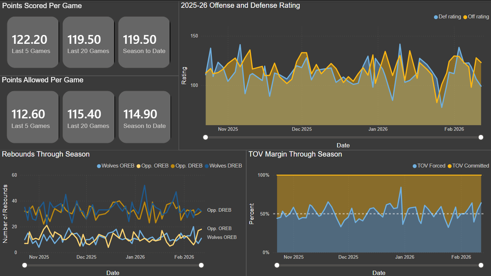
  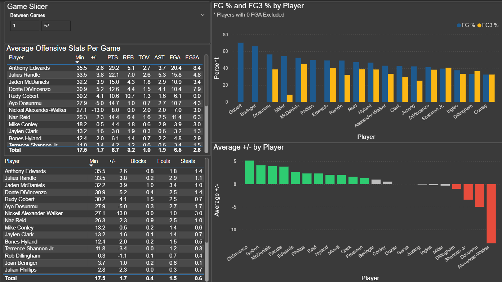

# Database Schema

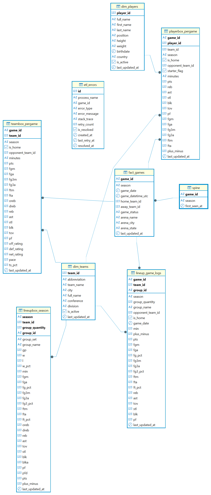

# Executive Summary
This report analyzes Minnesota Timberwolves performance data through the first 57 games of the 2024-25 season. The analysis covers three areas: team-level performance patterns, individual player contributions, and a regression-based evaluation of a specific lineup combination. Offensively, the team has been consistent and high-performing. Defensively, results have been volatile. The data suggests the capability for elite defensive performance exists but has not been applied thoroughly. The evidence points to a single underlying mechanism: high perimeter pressure reduces opponent shot volume but creates interior breakdowns that elite offenses exploit. Furthering this analysis will require shot location and defender proximity data not yet available in the current dataset. 
  
At the individual level, the starting five are clearly the correct unit. Each contributor occupies a distinct performance profile with minimal redundancy. Edwards leads the team in scoring while maintaining the most disciplined defensive profile of any perimeter player, and DiVincenzo's combination of ball security and creative decision-making produces the highest plus-minus on the roster. Key substitutes perform adequately within defined roles, with Terrance Shannon Jr. showing the most evidence for expanded usage. The Randle-Reid regression found no statistically significant evidence of a negative joint impact on offensive output or overall margin. The defensive model produced significant findings suggesting the pairing reduces the individual defensive value Reid provides alone, but roster construction makes it impossible to currently separate this effect from the near-certain absence of Gobert when the two share the floor. As with the earlier analysis shot location data not yet included in the current dataset.
  

# Team Performance
  

  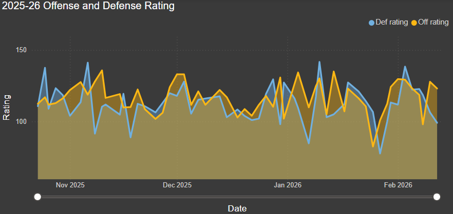

  

  Excluding the January 25th game against the Warriors, the team’s offensive rating has been moderately stable, staying between 100 and 125 with an average distance from the mean of 10.8 points compare to a league average of 11.4. The excluded game looks to be a fluke night because all starters played full minutes and in the following game, they played the same Warriors team as part of a back-to-back improving their offensive rating to 101 from 82. Defensive ratings have been much more volatile with four peaks near 140, multiple lows under 85 and an average distance from the mean of 12.8 compared to the league average of 11.4. Considering the limited sample size, the figure below suggests confirmation of these claims. As expected, when playing average defenses, the Timberwolves score slightly more than when playing the league’s best defenses. When facing the top eight offenses the results split sharply. Against the league’s best teams that are top eight in both offense and defense they allow an average of 112.1 points but against elite offenses with weaker defenses they allow 16.6 more points per game. This inconsistency and the multitude of high defensive rating peaks suggest the team has the capability to be an elite defensive unit but not yet the consistency and warrants further exploration into how they got exposed and under what conditions they defend well in.

  

  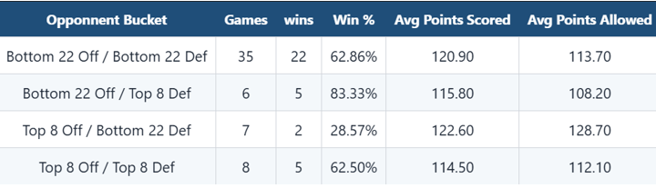

  

Examining opponent shooting relative to season averages shown in the table below provides further clarity on how these defensive breakdowns occur. Across all matchup types, opponents attempt fewer three-pointers than their seasonal baseline ranging from -3.7 to -10.5 attempts per game indicating a consistent ability to suppress three-point volume. However, the reduction in three-pointers made is proportionally smaller than the reduction in attempts in every scenario, suggesting that the attempts being conceded are of higher quality than average. This is most pronounced against Top 8 offensive / Bottom 22 defensive opponents in losses, where opponents made 0.9 more threes than their average despite taking 6.7 fewer, a meaningful efficiency gain that points to open looks being generated within a reduced shot rate.
  
The free throw data reveals two distinct mechanisms of defensive exposure depending on opponent type. Against Top 8 offensive teams that also rank in the top 8 defensively, losses are accompanied by a +9.4 increase in opponent free throw attempts relative to season average, the largest deviation in the dataset. In these losses teams shoot both less three pointers and less overall field goals while the total number made increases. This pattern is consistent with opponents generating high-value, interior-driven possessions rather than perimeter volume. In contrast, losses against Top 8 offensive / Bottom 22 defensive opponents are characterized by a +7.1 surge in field goals made on +4.1 additional attempts, with a more modest +1.9 increase in free throw attempts. This suggests a perimeter-oriented exposure, where opponents are stretching the defense across the floor and converting at an elevated rate, particularly on mid-range two-point attempts rather than attacking the basket directly. 
  
Together, these two profiles suggest that increasing perimeter defensive pressure, while effective at reducing shot volume, may be creating organizational breakdowns that simultaneously open interior lanes and perimeter looks. A tradeoff that likely manifests differently depending on the opponent's offensive profile. Rather than representing two isolated vulnerabilities, the data is consistent with a single underlying issue: pressure-induced defensive rotation gaps that elite offenses exploit in different ways based on their personnel and tendencies.  
  
To meaningfully advance this analysis, the next steps are to incorporate shot location data, which would allow for a more precise mapping of where field goal attempts are being generated. Complementing this with defender distance-at-shot data would quantify the degree to which defensive pressure is translating into genuinely contested looks versus open opportunities directly testing whether the three-point efficiency paradox identified here reflects defensive breakdowns or shot selection variance on the opponent's part. Together, these datasets would provide the resolution needed to move from identifying that defensive lapses occur to identifying where on the floor and under what defensive assignments they are most likely to emerge.

  

  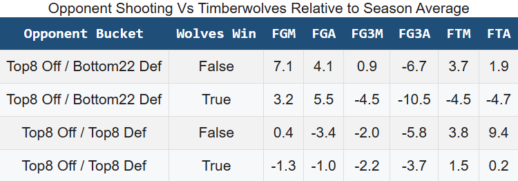

  

  The lower panels of the dashboard shown below indicates the teams possession creation metrics are nearly the same as the teams they play. There are no significant descrepancies in the number of offensive or defensive rebounds compared to opponents and the turnover margin seems to flip around 50%. As of now this is not an glaring issue because the offense is performing at a very high level. Since they do not dominate in total possessions and have a very volatile defense, there is a smaller margin for error making consistency required on the offensive side of the game.

  

  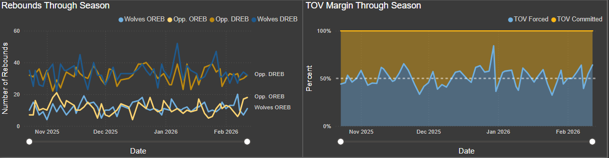

# Player Performance 

## Most Significant Contributers

  The team succeeds in multiple ways with many players making notable contributions. Despite the variety in player impact the typical starting five of DiVincenzo, Gobert, Randle, McDaniels and Edwards are the clearly most efficient, impactful players. Each player dominates in their own way with minimal overlap providing significant evidence the starting lineup has been consistently chosen correctly. 

 #### Anthony Edwards: leads category with his combination of scoring and disciplined defense 
 - Leads the team in scoring averaging seven more points a game than anyone else
 - Despite shooting 14 more shots a game than team average he is sixth in field goal percentage and third in 3-pt percentage
 - He’s the most impactful defender on the team averaging the second most steals and the most blocks of any guard while recording the lowest number of fouls for the starting five
  

 
  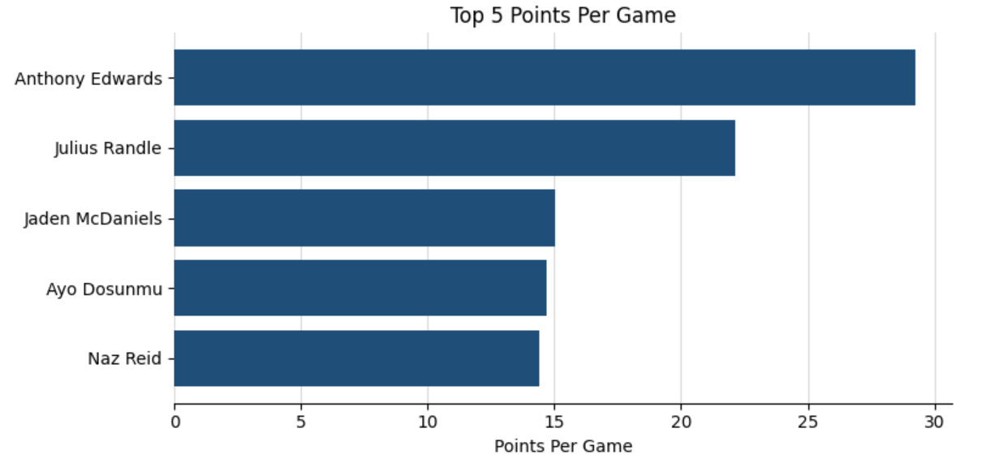 
  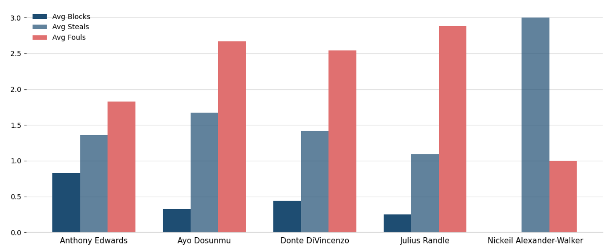 

 
  

#### Donte DiVincenzo: Team’s most reliable player recording the highest plus minus of 5.2
- Impact is largely contributed to ball-security and routine correct decision making
- He averages 4.2 assists per game (Second on team), 2.8 assists for every turnover (Highest on team), records as many steals as turnovers (Highest on team)
- Point of Improvement: Below-average scoring efficiency relative to role, performing comparably to lower-rotation players despite being a primary scoring option
  
  
 
    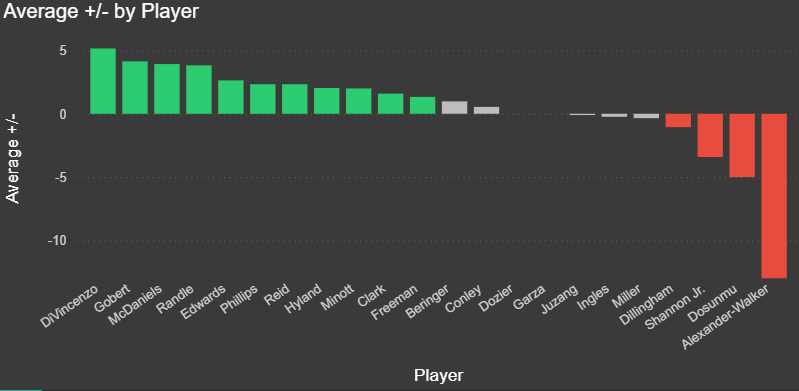 
    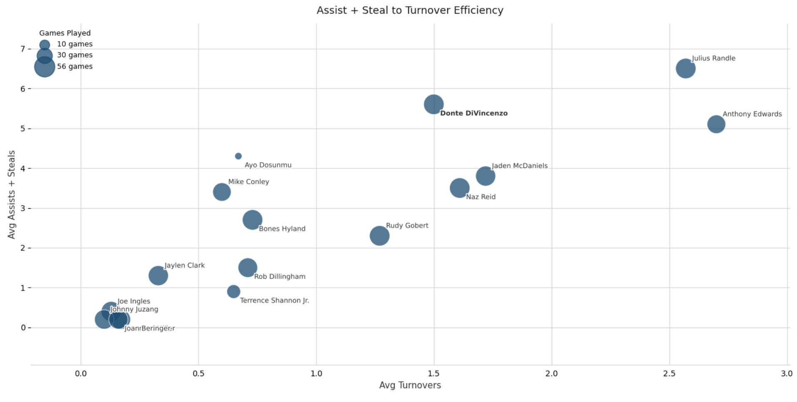 
  

  

Although Rudy Gobert, Julius Randle, and Jaden McDaniels remain positively impactful and justify their starting roles, each has their own distinct limitations. Gobert provides strong defensive value, reflected in his 1.5 blocks per game, yet his offensive contribution is narrowly concentrated. Despite leading the team in shooting efficiency, his scoring volume remains comparatively low and he does not contribute from three points attempts, the most valuable shot in basketball. Randle leads the team in assists but also records the highest turnover rate and ranks near the top in fouls committed. McDaniels demonstrates consistent shooting efficiency, particularly from three point range, but commits the most fouls on the roster and ranks among the top five in turnovers while providing limited playmaking output.

## Impactful Substitutes

#### Naz Reid: productive rotational contributor with clear role-based tradeoffs

- Serves as the primary substitute for Gobert and Randle, maintaining moderate defensive activity recording 0.6 fewer blocks per game than Gobert, a gap that understates the broader defensive differential given Gobert’s elite standing relative to Reid’s more average profile
- Provides stronger perimeter shooting efficiency than either starter he replaces, expanding offensive spacing and contributing diversified scoring
- Commits roughly half the turnovers of Randle but also generates approximately half the assists, reflecting lower usage and playmaking responsibility
- Has performed efficiently in his current role; however, relative defensive impact and overall influence metrics do not currently justify elevation to a starting position
  
  
 
    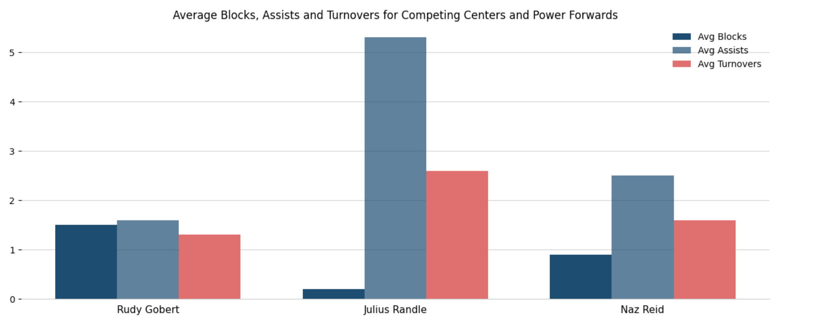 
    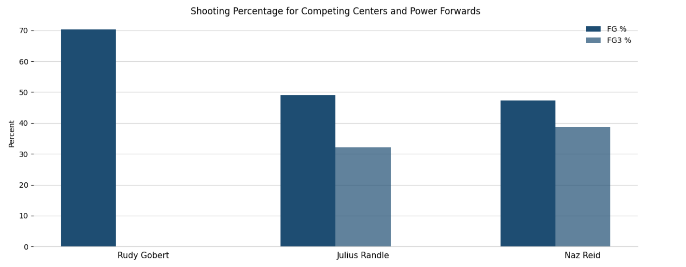 
  

  
  #### Terrance Shannon Jr.: low-usage perimeter specialist with evidence for increased playing time

- Operates as a third-string substitute for McDaniels, averaging 11 minutes per game versus a team average of 17, suggesting potential for increased playing time
- Shoots efficiently from three point range, within 5 percentage points of the team’s top performer McDaniels
- Records low turnover (.6), assist (.6), steals(.3) and foul (1.5) rates — all materially below team averages indicating limited impact outside of shooting
- Negative plus minus differential is likely influenced by low lineup quality and garbage time minutes
- Contribution profile is narrowly concentrated in shooting efficiency, but his low-error production suggests scalability without introducing significant volatility
  
  

    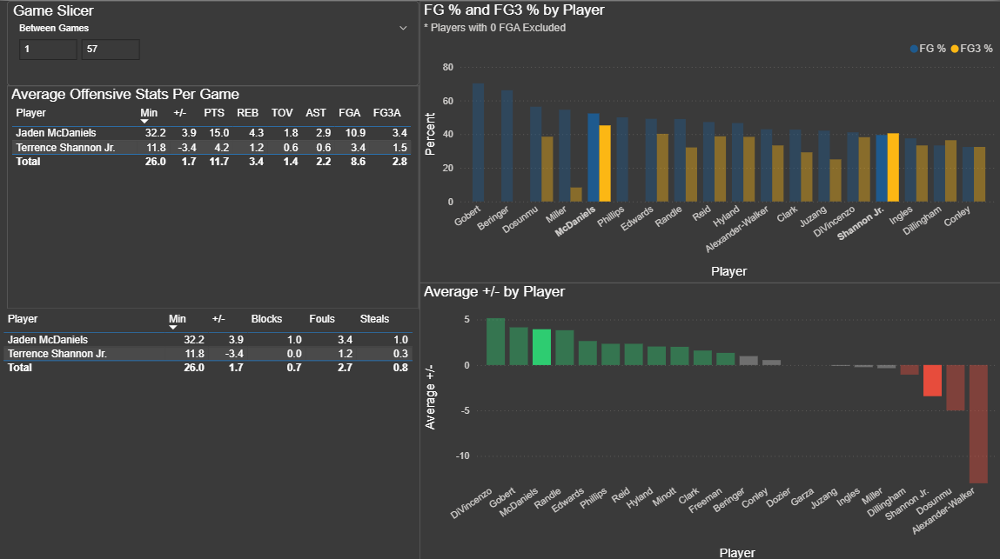 
  
 
  
#### Mike Conley: low-risk facilitator with limited scoring and defensive impact

- Functions as the primary substitute for DiVincenzo and provides strong ball retention, recording the lowest turnover rate (.6 per game) among players with significant minutes
- Ranks top five in assists, reinforcing his role as a stabilizing distributor
- However, he is the least efficient shooter on the roster while also shooting the least and rates below team average across defensive indicators
- Capable of maintaining operational stability, but extended usage may reduce overall efficiency due to limited scoring output and defensive contribution
    
  

    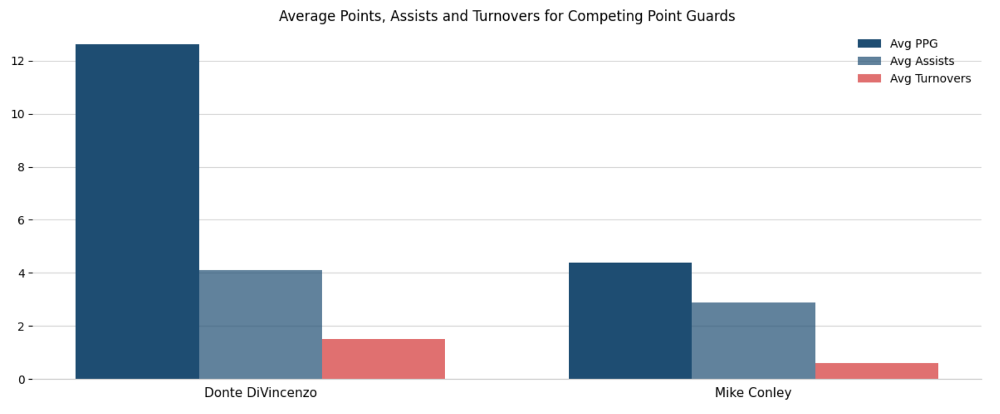 
    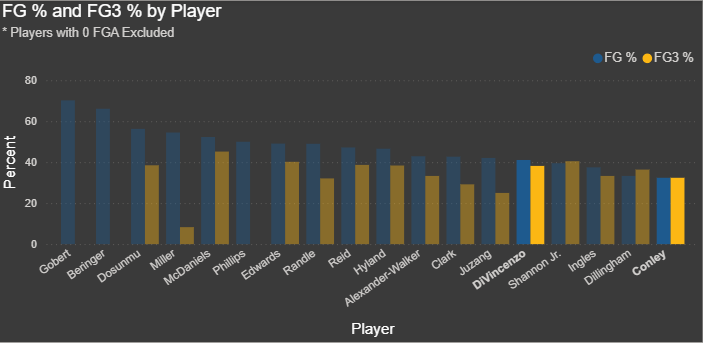 
  

  
  #### Bones Hyland: statistically neutral reserve presence

- Serves as the substitute for Anthony Edwards without exhibiting strong separation in any single performance category
- Metrics cluster near team averages across efficiency, turnover rate, assist generation, and defensive indicators
- Does not materially elevate or depress overall performance, functioning primarily as a neutral replacement option
  
   

    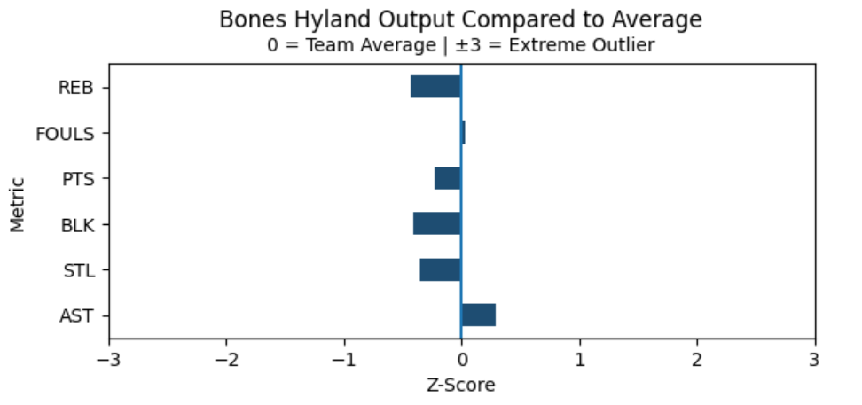 
  
 
  
## Julius Randle and Naz Reid Joint Impact

A popular narrative this season has been that Randle and Reid perform poorly when sharing the floor. This section applies a regression framework to evaluate whether lineup specific data  provides evidence of confirmation. Three separate weighted least squares regression models were estimated to evaluate whether lineup data substantiates that characterization across three outcome dimensions: overall lineup differential (plus_minus), offensive output (pts_per_min), and defensive output (ptsa_per_min). Each model included binary indicators for Randle's presence, Reid's presence, their multiplicative interaction term, and opponent fixed effects as covariates, with minutes played serving as regression weights to account for variation in lineup exposure. Heteroscedasticity-consistent standard errors (HC3) were applied throughout.
  
#### Sample Size and Statistical Power
All three models satisfy conventional sample size thresholds for model stability (N ≥ 162 for overall fit; N ≥ 118 for individual predictors). However, power adequacy is effect-size dependent and tells a more complete story. The plus_minus and pts_per_min models achieve power of 0.974 and 0.841 respectively, both exceeding the convential threshold of .80, while the ptsa_per_min model achieves only 0.688 given its smaller observed effect size (f² = 0.081), falling short of the threshold and requiring an estimated 239 observations for adequate power. The sample size is therefore sufficient for model stability across all three models but increases Type II error risk specifically in the defensive model. This can be easily addressed thorugh additional data collection. The current dataset captures lineup-level observations from only 13 of the 57 games played to date so incorporating the remaining game logs will increase the sample size  to satisfy the power threshold  without any change to the analytical framework. All remaining regression assumptions were assessed and satisfied; the full diagnostic outputs are documented in the technical appendix at the end of the report.
  
#### Overall Lineup Differential (plus_minus)
A weighted least squares regression was conducted to evaluate whether the presence of Randle, Reid, or their combination predicted lineup plus_minus, controlling for opponent identity. The overall model was not statistically significant (F(14, 181) = 1.018, p = .438), and explained 14.4% of variance in plus_minus (R² = .144, Adjusted R² = .078). Neither Randle's individual coefficient (β = 3.33, 95% CI [−2.82, 9.49], p = .289), Reid's individual coefficient (β = 2.03, 95% CI [−3.96, 8.03], p = .506), nor their interaction term (β = −3.41, 95% CI [−10.43, 3.60], p = .340) reached statistical significance. The data therefore provide no reliable evidence that the presence of either player, individually or jointly, produces a systematic effect on overall lineup margin when opponent strength is held constant.
  
#### Offensive Output (pts_per_min)
A second model estimated the effect of the same predictors on points scored per minute. The model approached but did not reach conventional significance (F(14, 181) = 1.563, p = .093), explaining 9.8% of variance (R² = .098, Adjusted R² = .028). Randle (β = −0.216, p = .574), Reid (β = −0.414, p = .314), and their interaction term (β = 0.461, p = .298) were all non-significant. The sole statistically significant predictor was a single opponent fixed effect (p = .019), reflecting opponent-specific variance rather than any systematic lineup effect. The model provides no evidence that the Randle-Reid pairing meaningfully influences offensive output per minute in either direction.
  
#### Defensive Output (ptsa_per_min)
The defensive model produced the most substantively interpretable findings, despite the overall model not reaching significance (F(14, 181) = 1.194, p = .283, R² = .075, Adjusted R² = .004). Reid's individual presence when Randle is not on the floor is associated with a statistically significant reduction of 0.715 points allowed per minute relative to baseline (β = −0.715, 95% CI [−1.383, −0.047], p = .036). Randle's individual coefficient, while also negative (β = −0.408, 95% CI [−1.024, 0.209]), does not reach significance (p = .195). The interaction term is positive and statistically significant (β = 0.842, 95% CI [0.080, 1.604], p = .030), indicating that when both players share the floor simultaneously, the combined effect is −0.281 points allowed per minute which is a substantial reduction in defensive benefit relative to Reid's individual coefficient alone. The interaction term is nearly equivalent in magnitude to Reid's main effect, meaning the pairing largely negates his independent defensive contribution rather than complementing it.
A critical consideration, however, tempers this interpretation. The team's roster construction creates a near-deterministic dependency: when Randle and Reid share the floor, their primary interior defensive anchor Rudy Gobert is almost certainly absent. Neither Randle nor Reid profiles as an above-average interior defender by conventional metrics, meaning the interaction term may be functioning as a proxy for that absence rather than capturing true incompatibility between the players themselves. If this is the case, the observed interaction effect would be confounded, and attributing the defensive deterioration to the pairing rather than to the missing personnel would be a misspecification of the underlying cause.
  
#### Conclusion, Limitations and Next Steps
Across all three models, the data does not support the characterization of the Randle-Reid pairing as a statistically reliable negative contributor to offensive output or overall lineup margin. The defensive model, despite falling below the conventional power threshold provides the most substantive signal. The model produces two statistically significant coefficients which may be understated by the lack of power collectively suggest the pairing is associated with a meaningful reduction in the independent defensive value Reid provides when alone on the floor. This finding warrants careful interpretation given the structural confound introduced by roster construction. When Randle and Reid share the floor, Gobert is almost certainly absent, and the interaction term cannot currently distinguish between a true inefficiency between the two players and the downstream consequence of removing the team's primary defensive anchor from the lineup. Since there are zero lineups with all three players together the best way to disentangle these effects would be to analyze shot charts to see typical shots, make percentage and general targeted areas of the court under each condition.
  
The team level data presents a offense with a consistent, high performing identity and a defensively capable but inconsistent unit. Edwards and DiVincenzo are the team's two most well-rounded contributors. Edwards as the primary scoring engine with elite defensive discipline for his position, and DiVincenzo as the most reliable overall performer by team point margin. Among substitutes, Reid performs effectively within his current role but the data does not support elevation to a starting position, and Shannon Jr. represents the strongest case for increased minutes based on shooting efficiency and low error rate. The starting lineup is well-constructed, and individual roles are appropriately assigned. The primary area of concern is defensive consistency, which the current dataset can identify but not fully explain. Resolving the mechanism behind the observed exposure patterns is the most pressing priority.
  

## Regression Technical Appendix
#### Power Calculation 
   

    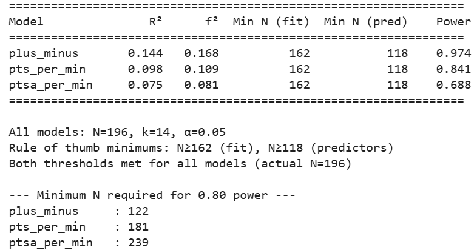 
  
 
  
#### Plus Minus Model
  

    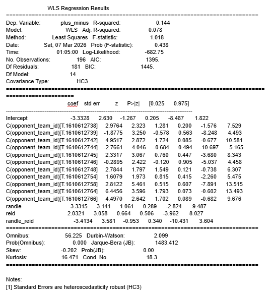 
  
 

  

    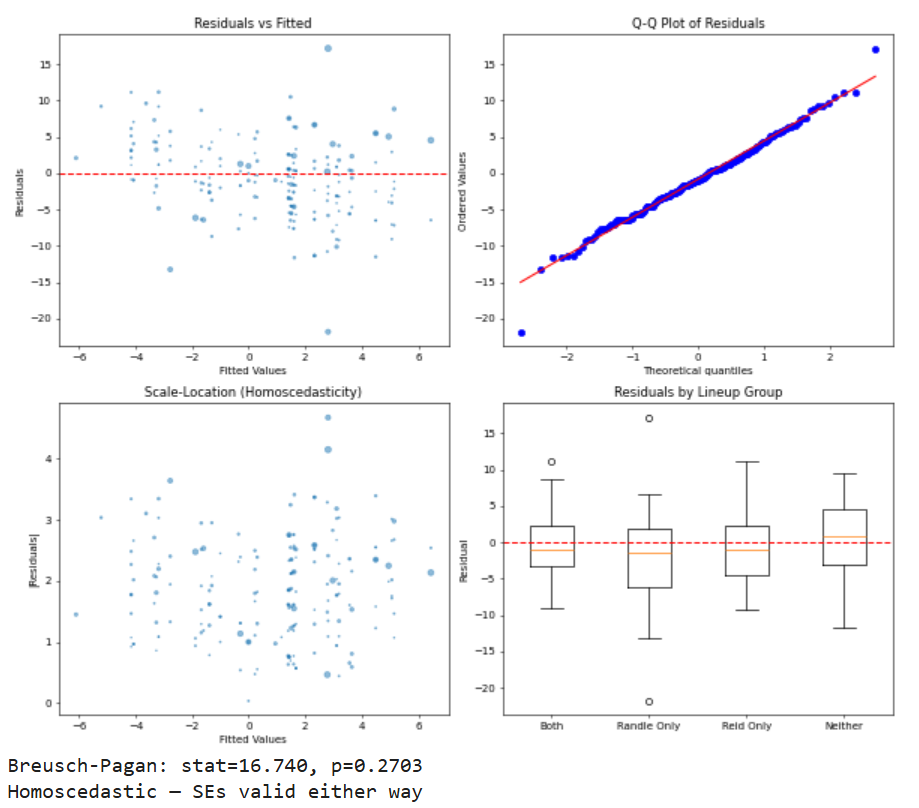 
    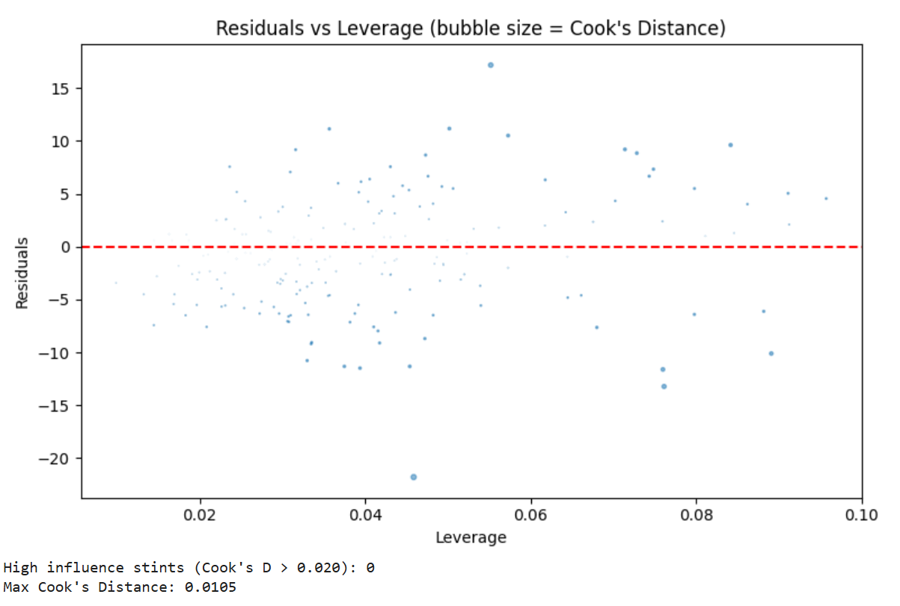 
  
 

  #### Pts Per Minute Model
  

    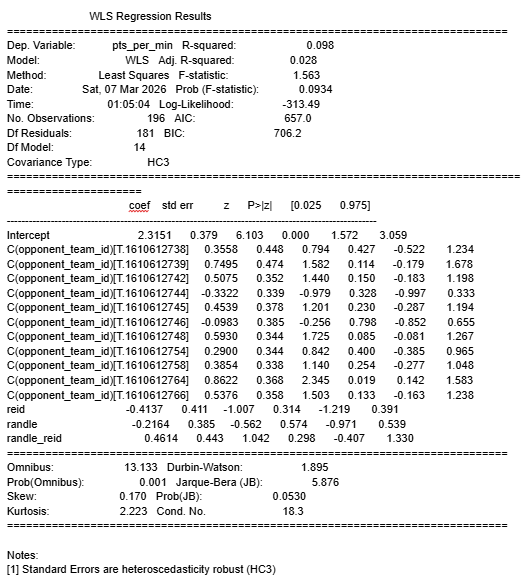 
  
 

  

    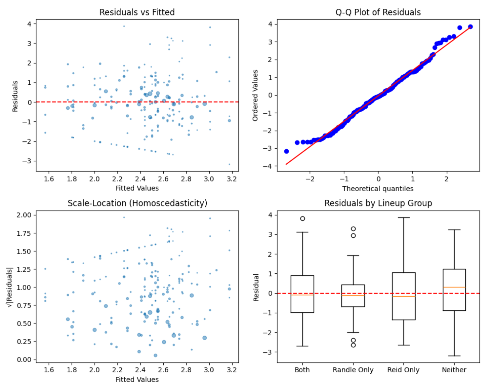 
     
  
 

  #### Ptsa Per Minute Model
  

     
  
 

  

    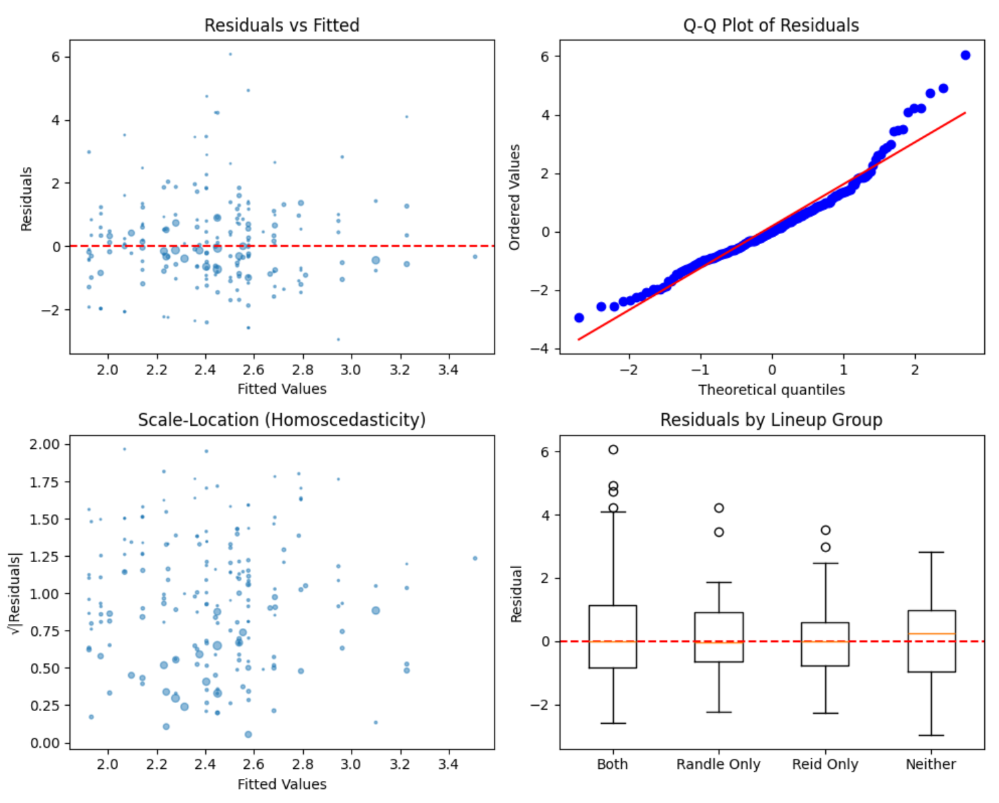 
     
  

  
