Contents

- Season Background
- Executive Summary
- Team Performance 
- Player Utilization
- Recommendations and Next Steps
- Monitoring Dashboards and Database Schema
- Repository Structure

  
# Season Background

There are two routes to the NBA playoffs. The top six teams in each conference earn immediate spots while the 7-10 teams play against each other to determine the last two spots. Currently at sixth in the Western Conference, the Timberwolves hold the last automatic spot, 9 wins behind first place, 2 wins ahead of 7th and 14 ahead of 11th.

Prepared for the coaching staff, this analysis evaluates the Minnesota Timberwolves' performance through the first 57 games of the 2025–26 season. The review identifies what drives the team's results and which adjustments would have the most impact on securing a top-six seed. The key insights and recommendations focus on the following areas:

**Northstar metrics:** 
-   Team Offense Rating: points generated per 100 possessions
-   Team Defensive Rating: points allowed per 100 possessions

**Key Areas:** 
- Defensive Scheme Breakdown: what causes low, variable defensive ratings despite the presence of a four-time NBA Defensive Player of the Year Rudy Gobert.
- Performance by opponent quality: how results change against opponents grouped by offensive and defensive strength.
- Key contributors: which players drive the team's results.
- Player utilization: how efficiently are players strengths, weaknesses and playing time being managed.

# Executive Summary

  

  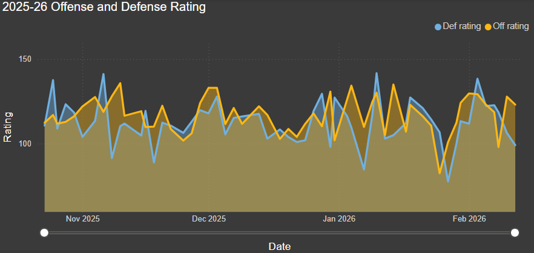

<table>
<tr>
<th></th>
<th colspan="2">Offensive Rating</th>
<th colspan="2">Defensive Rating</th>
</tr>
<tr>
<th></th>
<th>Avg</th><th>SD</th>
<th>Avg</th><th>SD</th>
</tr>
<tr>
<td><b>Timberwolves</b></td>
<td>116.7</td><td>10.8</td>
<td>112.6</td><td>12.8</td>
</tr>
<tr>
<td><b>League Average</b></td>
<td>114.4</td><td>11.4</td>
<td>114.4</td><td>11.4</td>
</tr>
</table>

<table>
<tr>
<th width="50%">Team Performance</th>
<th width="50%">Player Utilization</th>
</tr>
<tr>
<td width="50%" valign="top">

1. **Defensive Scheme Breakdowns**
   - Defensive rating averages 112.6, better than the league's 114.4, but varies 12% more from game to game.
   - Aggressive perimeter pressure limits 3-point attempts and makes by ~5.5% each but allows 5% more 2-point attempts and 6% more freethrows
2. **Performance by Opponent Quality** 
   - Minnesota wins 57% of games against bottom-22 defenses vs. 71% against top-8 defenses, a gap driven by a 2–5 record against elite offenses that defend poorly.
   - Games against weak defenses run about 6 points higher on both ends, but the margin barely changes, so the extra losses come from specific matchups rather than game pace.

</td>
<td width="50%" valign="top">

3. **Key Contributors**
   - All five starters rank in the team's top five in average plus-minus, each filling a distinct role.
   - Anthony Edwards: leading scorer at 29.2 points per game while committing the fewest fouls of any perimeter starter (1.8).
   - Donte DiVincenzo: leads the team in both assist to turnover ratio (2.7) and plus-minus (+5.2)
4. **Underutilized Players** 
   - Terrance Shannon Jr.: second highest 3-point percentage playing the fifth least minutes. 
   - Mike Conely: least amount of turnovers and second in assists but is the least efficient shooter on the team

</td>
</tr>
</table>

<table>
<tr>
<th>Key Takeaways and Recommendations</th>
</tr>
<tr>
<td>

1. **Rethink the perimeter-first scheme.** Limiting 3-point attemps creates 2-point opportunities and an increase in fouls. Play to Gobert's strengths by testing a defensive approach that prioritizes rim protection strengths, especially against offenses that rely on a center.
2. **Keep the starting five intact.** All five starters lead the team in plus-minus, and each fills a distinct role.
3. **Expand Terrance Shannon Jr.'s minutes** as the first rotation adjustment inplace of Bones Hyland. Pairing him with Mike Conely could be used to maintain leads while giving the starters rest but these two will need to be paired with Gobert to offset their defensive limitations.
</td>
</tr>
</table>

  
# Team Performance

  
  
 
    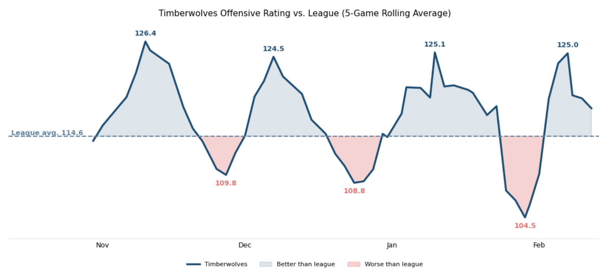 
    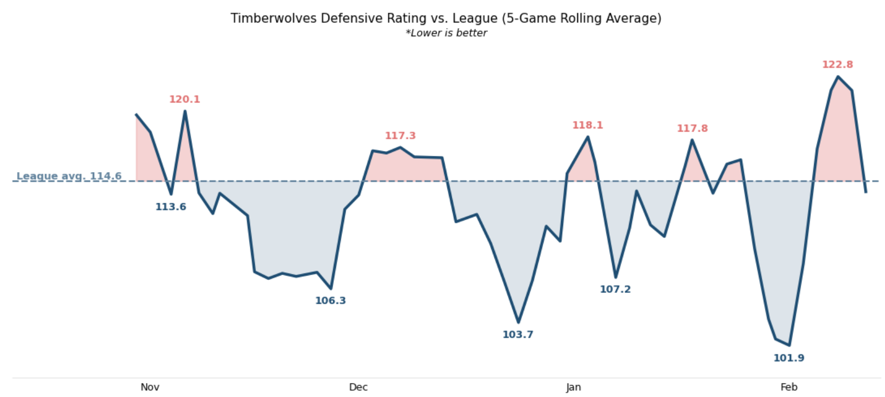 
  

  

Every difference in offensive and defensive rating comes down to four factors: shooting efficiency, turnovers, rebounding and free throw rate. Introduced by Dean Oliver and now standard across NBA analytics, these factors are measured per possession, so game speed doesn't distort them. Grading Minnesota and its opponents on each factor against the league average shows exactly which part of the game drives each rating.

  
## Offense

<table>
<tr>
<th width="50%">Shooting and Free Throws</th>
<th width="50%">Rebounding and Turnovers</th>
</tr>
<tr>
<td align="center">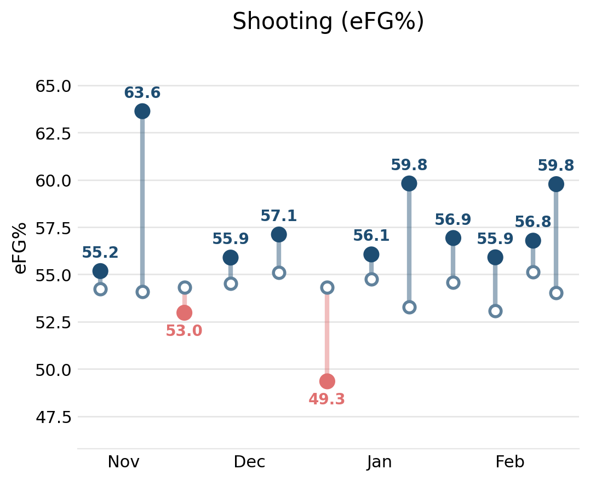</td>
<td align="center">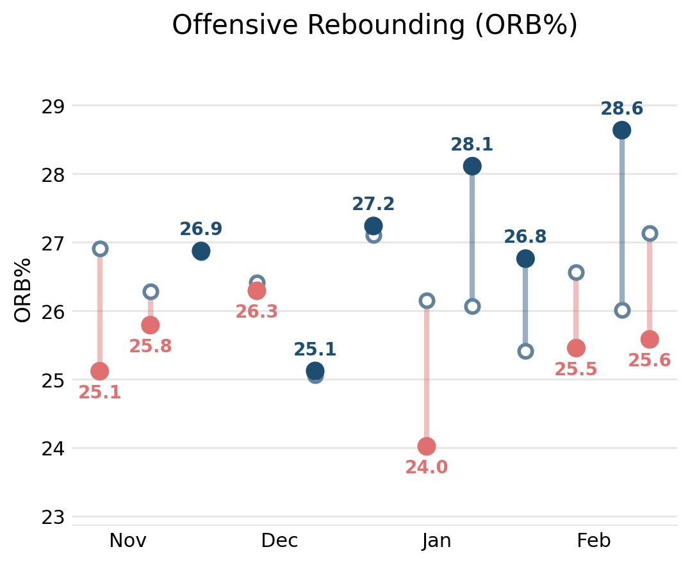</td>
</tr>
<tr>
<td align="center">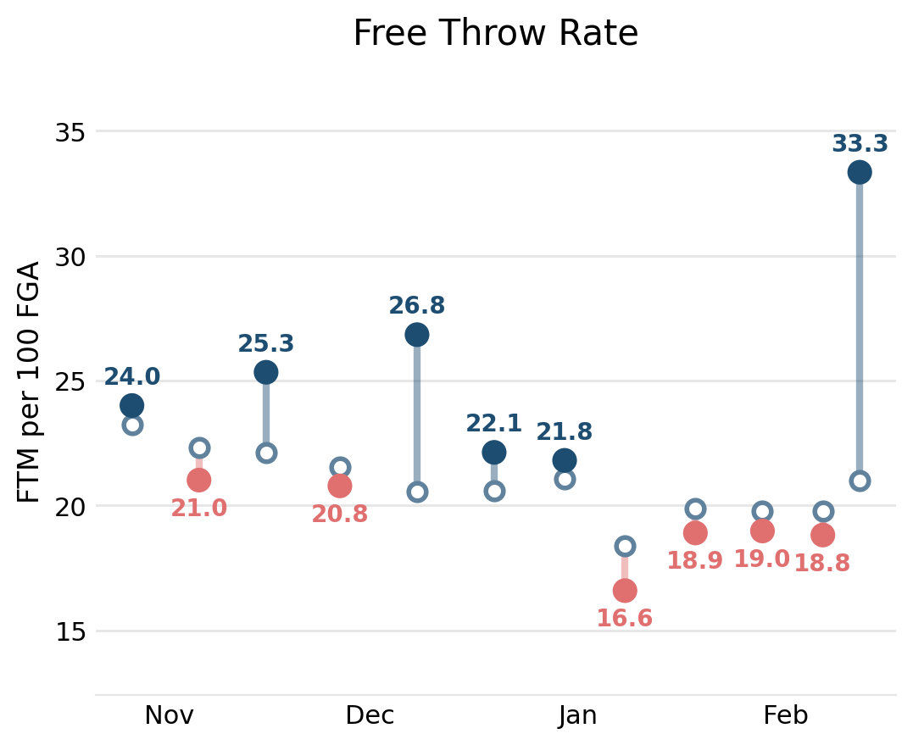</td>
<td align="center">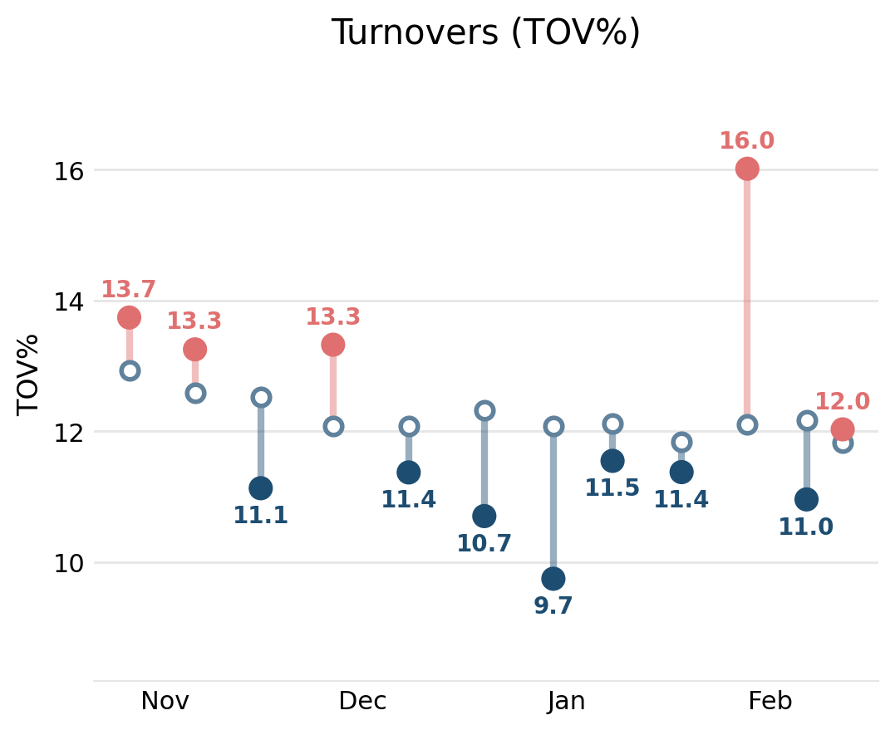</td>
</tr>
<tr>
<td colspan="2" align="center"></td>
</tr>
<tr>
<td width="50%" valign="top">

1. **Shooting Efficiency (eFG%):** the largest driver of offensive rating
   - Jaden McDaniels, Terrance Shannon Jr. and Anthony Edwards lead the team
   - The season-low 49.3% stretch came from McDaniels, Julius Randle and Edwards shooting 23%, 11% and 7.5% below their season averages. All three returned to their usual levels the next stretch. 
2. **Free Throw Rate:** neutral impact on offensive rating
   - Trends with league average apart from two positive outlier stretches
   - 26.8 makes per attempt outlier stretch was led by Julius Randle (39/43) and Anthony Edwards (25/29)
   - 33.3 makes per attempt outlier stretch covers only the final two games. Given the season to date trend it is unlikely to hold throughout the stretch.

</td>
<td width="50%" valign="top">

3. **Offensive Rebounding (ORB%):** no meaningful impact on offensive rating
   - No single player drove the highs or lows the deviations were team wide.
   - Every stretch is within 2.3 points of the season average.
   - Stretches are equally split above and below league average.
5. **Turnovers (TOV%)** no significant impact on offensive rating
   - Trends with the league average apart from the 16% turnover rate stretch.
   - Outlier stretch was team wide but had significant contributions from DiVincenzo, Reid, Hyland, and McDaniels who each committed 3-5 more than usual.
   - Without that stretch, Minnesota's TOV% is 11.7, slightly better than the league, and it dropped back to 11.0 in the very next stretch.

</td>
</tr>
</table>

  
## Defense

<table>
<tr>
<th width="33%">Shooting</th>
<th width="33%">Turnovers</th>
<th width="33%">Rebounding</th>
</tr>
<tr>
<td>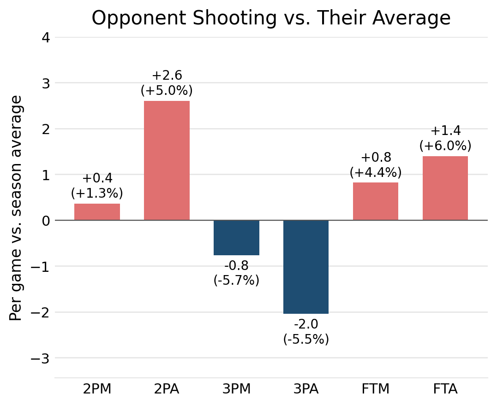</td>
<td>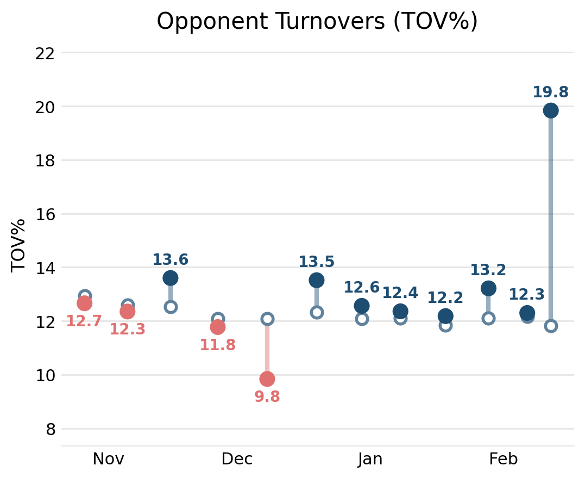</td>
<td>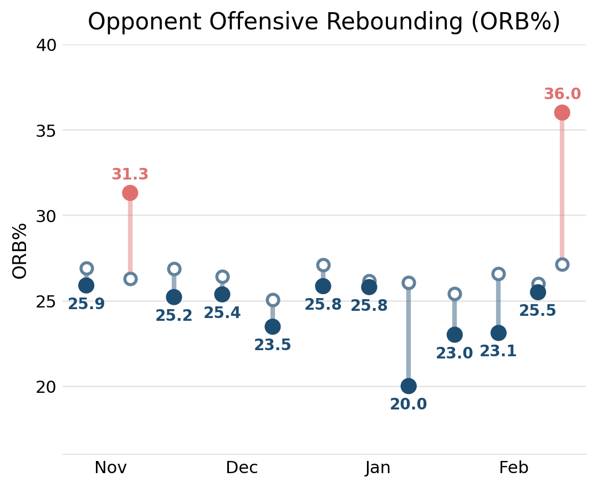</td>
</tr>
<tr>
<td colspan="3" align="center"></td>
</tr>
<tr>
<td valign="top">

1. **Opponent Shooting:** inefficiently disrupts target areas
   - The agressive perimeter pressure moves shots where it wants them. Opponents take about 2 fewer threes and 2.6 more twos per game than usual. Gobert then reduces their 2-point percentage by 3.5%.
   -  Results in zero effect on 3-point scoring. Opponents make threes at their normal rate of 35.8% vs 35.9% against Minnesota.
   - Perimeter pressure creates more interior space putting Gobert and other interior defenders in difficult spots where they need to foul increasing foul trouble and easy points.
</td>
<td valign="top">

2. **Forced Turnovers** 
   - Trends with the league. Opponents turn it over on 12.5% of possessions against the Wolves, compared with a league average of 12.2% (12th). All but two stretches are within about 1 point of the league.
   - The most recent stetch of 19.8% is only 2 games and will likely come back down. A 2-game sample can swing a lot, and no other stretch is above 13.6, so expect this number to drop toward the normal range.
   - Minnesota has forced more turnovers than the league in each of the last 6 full stretches. Although the margins were small the consistency is a steady edge to rely on.

</td>
<td valign="top">

3. **Defensive Rebounding**
   - The 36.0 stretch is only 2 games and will likely come back down. It's the highest in the chart by almost 5 points, and a 2-game sample swings easily. 
   - 9/11 other stretches are within 2 points of league average with the 2 significant deviations splitting above and below.
   - The margins are small, but they're consistently on the right side. The Wolves held opponents below the league average in 10 of 11 full stretches, and for the season they allow 25.2% compared with a league average of 26.1% (7th best).

</td>
</tr>
</table>

  
# Player Utilization

  
## Most Significant Contributers

  The team succeeds in multiple ways with many players making notable contributions. Despite the variety in player impact the typical starting five of DiVincenzo, Gobert, Randle, McDaniels and Edwards are the clearly most efficient, impactful players. Each player dominates in their own way with minimal overlap providing significant evidence the starting lineup has been consistently chosen correctly. 

 #### Most impactful player: Anthony Edwards 
 - Leads the team in scoring averaging seven more points a game than anyone else.
 - Despite shooting 14 more shots a game than team average he is sixth in field goal percentage and third in 3-pt percentage.
 - Impactful defender averaging the second most steals and the most blocks of any guard. 
  

 
  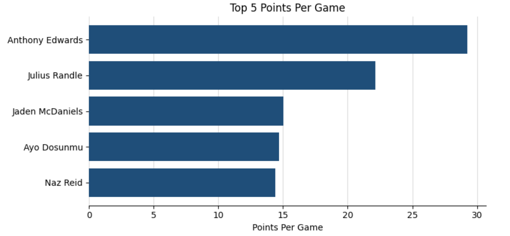 
  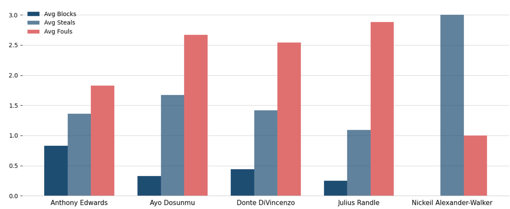 

 
  

#### Most reliable player: Donte DiVincenzo
- Impact is largely contributed to ball-security and routine decision making.
- He averages 4.2 assists per game (Second on team), 2.8 assists for every turnover (Highest on team), records as many steals as turnovers (Highest on team).
- Point of Improvement: Below-average scoring efficiency relative to role, performing comparably to lower-rotation players despite being a primary scoring option.
  
  
 
    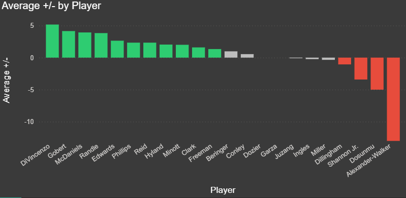 
    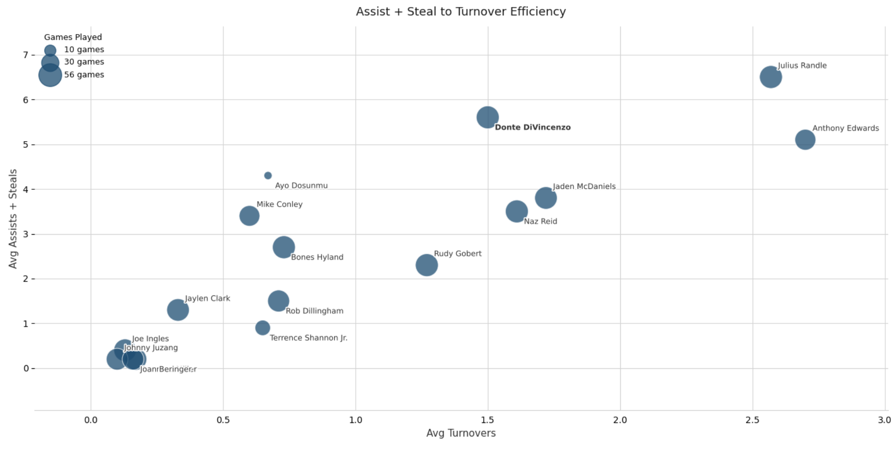 
  

  

**Rudy Gobert:** Most impactful defender who significantly limits the teams offense.
- 4 time NBA Defensive Player of the Year and team leading 1.5 blocks per game.
- Has not attempted a 3-pointer this season allowing defenders to stay near the basket crowding his teammates.
- Contributable scorer leading the team in shooting efficiency but has the third lowest volume among significant players.

**Jaden McDaniels:** Top 3-point shooter who plays with foul and turnover risk.
- Leads the team in 3-point percentage.
- Commits the most fouls on the team (3.4 per game).
- Ranks third in both assists and turnovers.

**Julius Randle:** Primary playmaker whose high usage brings turnovers.
- 22.1 points per game, second only to Anthony Edwards.
- Leads the team in assists (5.3 per game) and turnovers.
- 2.9 fouls per game, second only to McDaniels.

## Impactful Substitutes

#### Naz Reid: productive rotational contributor with clear role-based tradeoffs

- Serves as the primary substitute for Gobert and Randle, maintaining moderate defensive activity recording 0.6 fewer blocks per game than Gobert, a gap that understates the broader defensive impact of Gobert. 
- Provides stronger perimeter shooting efficiency than either starter he replaces, expanding offensive spacing and contributing diversified scoring.
- Commits roughly half the turnovers of Randle but also generates approximately half the assists, reflecting lower usage and playmaking responsibility.
- Has performed efficiently in his current role; however, relative defensive impact and overall influence metrics do not currently justify elevation to a starting position.
  
  
 
    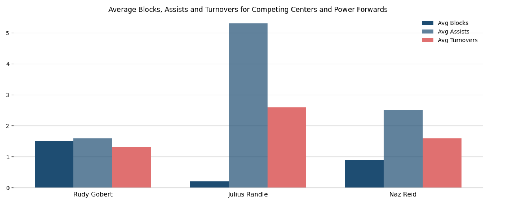 
    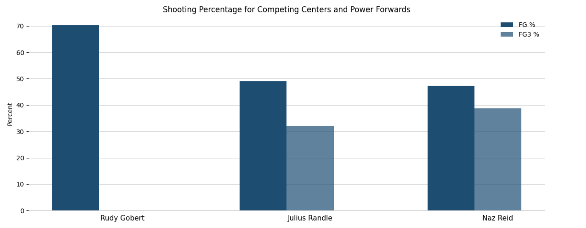 
  

  

  #### Bones Hyland: Neutral reserve presence

- Serves as the substitute for Anthony Edwards and Jaden McDaniels without exhibiting strong separation in any single performance category.
- Metrics cluster near team averages across efficiency, turnover rate, assist generation, and defensive indicators.
- Does not materially elevate or depress overall performance, functioning primarily as a neutral replacement option.
  
   

    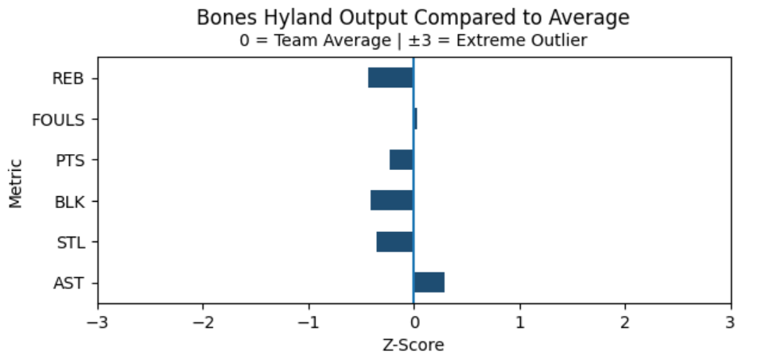 
  
 
  

  #### Terrance Shannon Jr.: Low-usage perimeter specialist with a case for Bones Hylands minutes.

- Operates as a third-string substitute for McDaniels, averaging 11 minutes per game well below the team average of 17.
- 41% 3-point percentage, second only to McDaniels.
- Minimal ability outside of shooting recording near team low turnover (.6), assist (.6), steals(.3) and foul (1.5) rates.
- Negative plus minus differential is likely influenced by low lineup quality and garbage time minutes.
  
  

    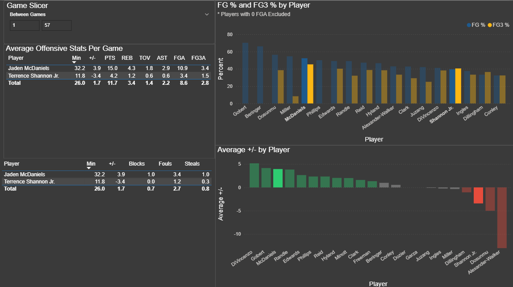 
  
 
  

#### Mike Conley: Low-risk facilitator with limited scoring and defensive impact

- Functions as the primary substitute for DiVincenzo and provides strong ball retention, recording the lowest turnover rate (.6 per game) among players with significant minutes.
- Ranks top five in assists, reinforcing his role as a stabilizing distributor.
- However, he is the least efficient shooter on the roster while also shooting the least and rates below team average across defensive indicators.
- Capable of maintaining operational stability, but extended usage may reduce overall efficiency due to limited scoring output and defensive contribution.
- Can be paured with Terrance Shannon Jr. to maintain leads while giving starters rest. 
    
  

    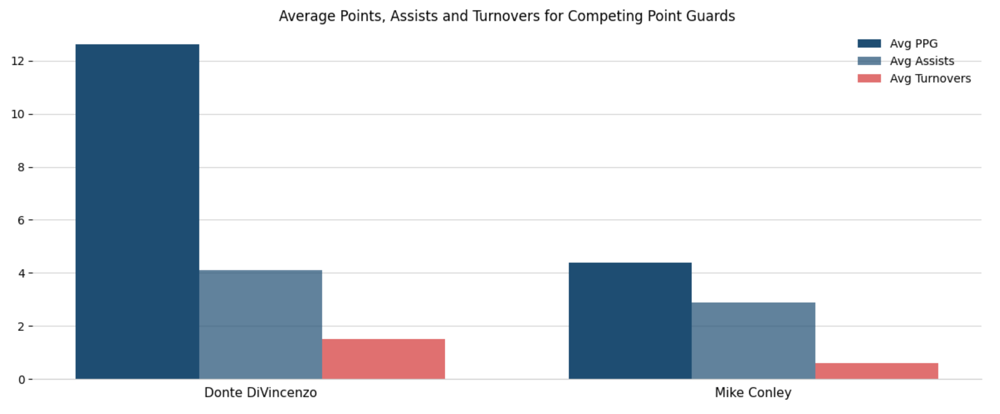 
    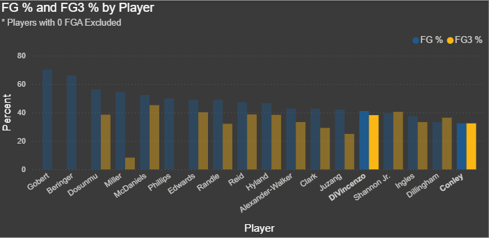 
  

  

# Recommendations and Next Steps
---
**Team and Player Monitoring Dashboards**

  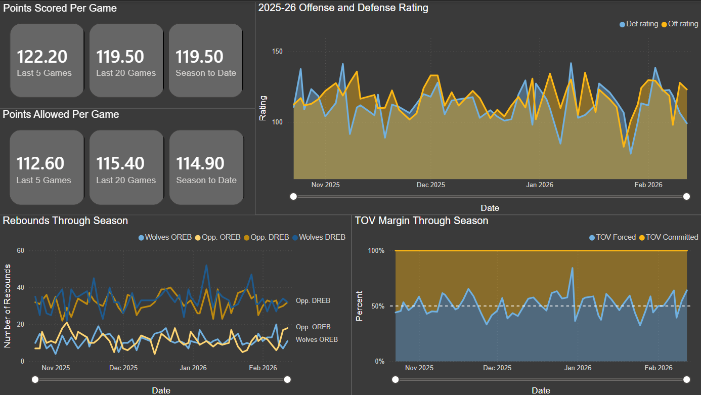
  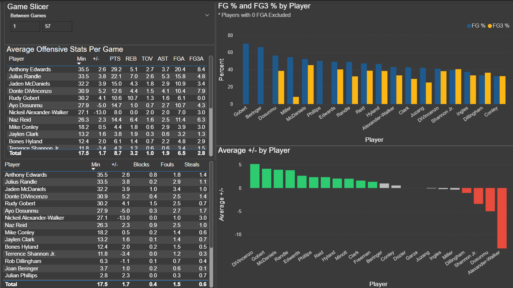

---
**Database Schema**

  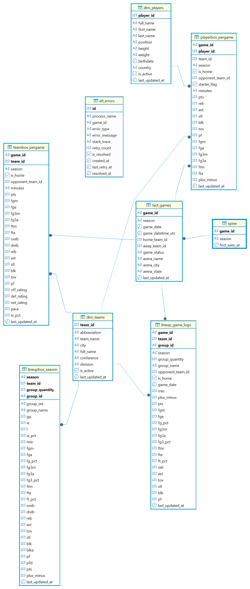

# Repository Structure
Scripts/
  - create_core_tables.py creates tables used to store the data
  - weekly_run.py runs the scheduled pipeline

sql folder holds sql files for creating aggregations for visualizations and preparations to use in the analysis

src/db/schema holds sql files for table creation ran with the create_core_tables script
  
